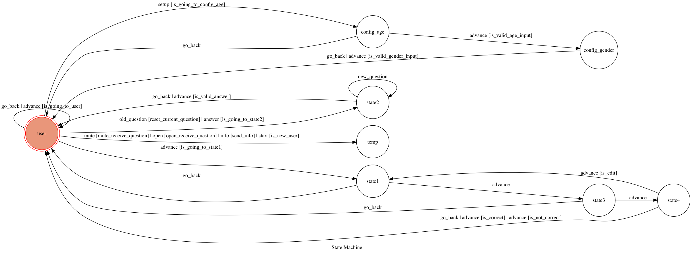

# Crowd Choice BOT

A Telegram QA BOT

> Template Code for TOC Project 2017
> A telegram bot based on a finite state machine

## Setup


#### Install Dependency
```sh
pip install -r requirements.txt
```

* pygraphviz (For visualizing Finite State Machine)
    * [Setup pygraphviz on Ubuntu](http://www.jianshu.com/p/a3da7ecc5303)

#### Install Redis
```sh
brew install redis
```

#### Launch Redis
```sh
launchctl load ~/Library/LaunchAgents/homebrew.mxcl.redis.plist
```

### Secret Data

`API_TOKEN` and `WEBHOOK_URL` in config.py **MUST** be set to proper values.
Otherwise, you might not be able to run your code.

### Run Locally
You can either setup https server or using `ngrok` as a proxy.

**`ngrok` would be used in the following instruction**

```sh
ngrok http 5000
```

After that, `ngrok` would generate a https URL.

You should set `WEBHOOK_URL` (in app.py) to `your-https-URL/hook`.

#### Run the sever

```sh
python app.py
```

## Finite State Machine


## Usage
The initial state is set to `user`.


## Command
* /start - Start the Bot (Create the user) or send command sheet
* /question - Ask new question 
* /answer - Get a question and answer it 
* /info - Check Current condition 
* /mute - Mute new question notification
* /open - Open new question notification
* /setup - Setup User info

## Database

### TABLE QUESTION_ANSWER
 	QUESTION_ID     INTEGER PRIMARY KEY     AUTOINCREMENT,
    ASKER_ID        INTEGER                 NOT NULL,
    DESCRIPTION     TEXT                    NOT NULL,
    OPTIONS         BLOB                    ,
    TAGS            BLOB                    ,
    TYPE            TEXT                    NOT NULL,
    CREATED_AT      TEXT                    NOT NULL,
    STARS_COUNT     BLOB                    ,
    RAT_COUNT       INTEGER DEFAULT 0

### TABLE QUESTION_ANSWER
 	ANSWER_ID       INTEGER PRIMARY KEY     AUTOINCREMENT,
    QUESTION_ID     INTEGER                 NOT NULL,
    ANSWERER_ID     INTEGER                 NOT NULL,
    ANSWER          TEXT                    NOT NULL,
    TAGS            BLOB                    ,
    TYPE            TEXT                    NOT NULL,
    CREATED_AT      TEXT                    NOT NULL,
    STARS_COUNT     BLOB                    ,
    RAT_COUNT       INTEGER DEFAULT 0

### TABLE USER_PROFILE
	USER_ID         INTEGER PRIMARY KEY     NOT NULL,
    GENDER          TEXT                    ,
    AGE             TEXT                    ,
    SUBSCRIBE       TEXT DEFAULT "On"       ,
    STATE           TEXT DEFAULT "user"     NOT NULL,
    CREATED_AT      TEXT                    NOT NULL,
    COIN            INTEGER DEFAULT 15      ,
    LEVEL           INTEGER DEFAULT 1       ,                
    CONDITION       TEXT DEFAULT "NORMAL"   ,
    RAT_COUNT       INTEGER DEFAULT 0


## Fork From 
[Lee-W TOC-Project-2017](https://github.com/Lee-W/TOC-Project-2017)
